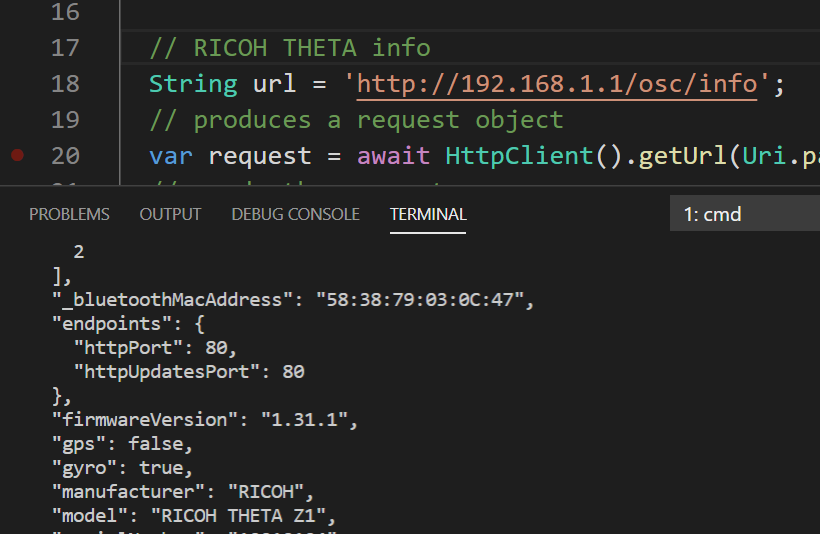

# RICOH THETA Dart HTTP Request tests

RICOH THETA API requests for models V, Z1, and SC2. [API reference](https://api.ricoh/docs/theta-web-api-v2.1/)

## References

* [Dart HttpClient](https://codeburst.io/quick-tip-how-to-make-http-requests-in-dart-53fc407daf31)
* [Pretty Print JSON](https://colinstodd.com/posts/code/pretty-print-json-in-dart.html)

