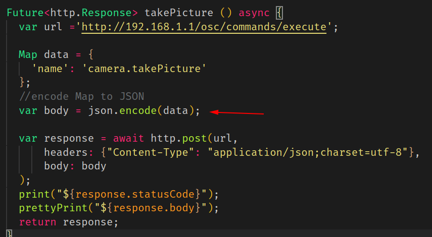
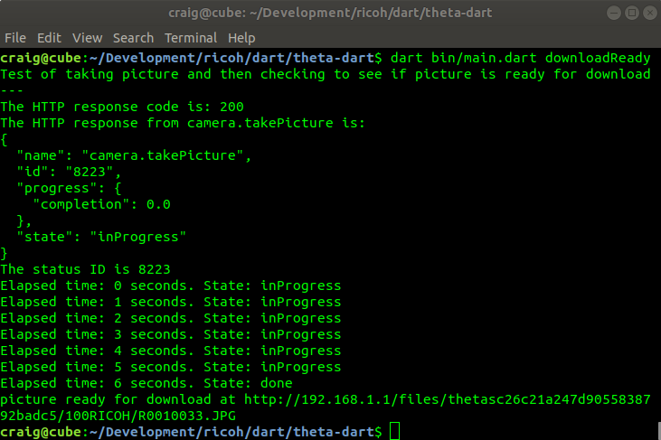

# RICOH THETA API HTTP Community Tests

Last updated January 25, 2021.

This is a community document based on contributions of
informal test results 
from the [theta360.guide independent community](https://www2.theta360.guide/).  This is
not an official RICOH document.  For official information, please
contact RICOH.  You should confirm these community tips with your
own tests prior to deployment in a business setting.  As these are
unofficial tips, the official RICOH THETA API may change unexpectedly
and these techniques could stop working. 

Official API reference information from RICOH:

* [RICOH Developer Connection THETA Web API v2.1](https://api.ricoh/docs/theta-web-api-v2.1/)
* [THETA API 2.1 Android SDK on RICOH Official GitHub Repository](https://github.com/ricohapi/theta-api2.1-android-sdk)
* [THETA API 2.1 iOS SDK on RICOH Official GitHub Repository](https://github.com/ricohapi/theta-api2.1-ios-sdk)


## Overview

The RICOH THETA WebAPI is based on the [Google Open Spherical Camera API](https://developers.google.com/streetview/open-spherical-camera/reference).  Developers build mobile apps that communicate with the RICOH THETA camera using Wi-Fi and a HTTP protocol using GET and POST commands. 

Our community examples test the HTTP request and response behavior of the RICOH THETA using Dart. You can also use 
[curl](https://curl.se/) from the command line or a HTTP API tester such as [Postman](https://www.postman.com/). 

Our examples are designed so that you can easily read the JSON request without any knowledge of Dart.
The contents of the HTTP request will be identical in any programming language.  
In the example below, Dart code is used to get the state of the 
RICOH THETA camera.  The response is in JSON.

```dart
void postState() async {
  var response = await http.post('http://192.168.1.1/osc/state');
  prettyPrint(response.body);
}
```

### Reading the Example Code

In the example below, the relevant pieces of information to focus on are:

* HTTP endpoint: `http://192.168.1.1/osc/commands/execute`
* data payload: `{'name': 'camera.takePicture'}`
* HTTP header: `{"Content-Type": "application/json;charset=utf-8"}`
* HTTP request method: POST

```dart
Future<http.Response> takePicture () async {
  var url ='http://192.168.1.1/osc/commands/execute';

  Map data = {
    'name': 'camera.takePicture'
  };
  //encode Map to JSON
  var body = jsonEncode(data);

  var response = await http.post(url,
      headers: {"Content-Type": "application/json;charset=utf-8"},
      body: body
  );
  print("The HTTP response code is: ${response.statusCode}");
  print("The HTTP response from camera.takePicture is:");
  prettyPrint("${response.body}");
  return response;
}
```

By using the Dart examples as a reference, you can build your own tests with languages such
as Swift or Kotlin. 

Dart is new and we understand that most people are not using Dart to build their mobile and desktop apps. 
These two tips will help you to use the Dart examples with another language.

1. Although Dart looks like JavaScript, it does not store information as JavaScript objects.
The requests from Dart are contructed in a Dart map, which looks very similar to JSON. Just 
be aware that the examples use `jsonEncode` and `jsonDecode` to convert between JSON and Dart maps.

2. Similar to other languages, Dart uses the concepts `async`/`await` and futures for asynchronous programming.
If these concepts are new, you can largely ignore them for curl, Python, bash, and Postman tests.  Focus on the http endpoint and JSON payload.


## Status

Camera models tests:

* SC2 with firmware 1.31
* Z1


The SC2 API has many differences from the API used with the V and Z1.  

As of January 25, 2021, 

* the official RICOH online [API documentation](https://api.ricoh/docs/theta-web-api-v2.1/) is not an accurate
reference to build SC2 applications. Differences include:
  * thumbnail display
  * camera presets
  * reset settings
  * use of state and status to see when the camera is ready for the next command after you take a picture
  * metadata injection into image file not working
* the iOS and Android SDKs on the RICOH GitHub repo have problems with the getLivePreview motionJPEG response.


## Update Camera Firmware

Firmware for RICOH THETA cameras can be updated with the desktop app on Mac or Windows or the mobile app on Android or iOS. 
The desktop app connects with a USB cable and is good, stable connection. 

## Usage

1. connect workstation to THETA with camera in access point (AP) mode
2. run `main.dart` file in `bin` with the appropriate command

### Camera to Workstation Connection

This sample application only connects with Wi-Fi in access point mode. You computer will need to connect to the camera as a hotspot.
The IP address of the camera will always be 192.168.1.1. You cannot change the IP address.  

To connect to the Internet, you must have two network interfaces on your computer.  For example, your computer can connect to your
home router with Ethernet and use Wi-Fi to connect to the THETA.  You can also use the existing Wi-Fi of your laptop to connect
to the Internet and a USB Wi-Fi adapter to connect to the THETA.


### Example with info

```dart
$ dart bin/main.dart info
{
  "manufacturer": "RICOH",
  "model": "RICOH THETA SC2",
  "serialNumber": "20001005",
  "firmwareVersion": "01.31",
  "supportUrl": "https://theta360.com/en/support/",
  "gps": false,
  "gyro": true,
  "endpoints": {
    "httpPort": 80,
    "httpUpdatesPort": 80
  },
  "apiLevel": [
    2
  ],
  "api": [
    "/osc/info",
    "/osc/state",
    "/osc/checkForUpdates",
    "/osc/commands/execute",
    "/osc/commands/status"
  ],
  "uptime": 2709,
  "_wlanMacAddress": "58:38:79:2b:ad:c5",
  "_bluetoothMacAddress": "6c:21:a2:47:d9:05"
}
```


Instead of info, you can also use other commands:

### Example with state

```
$ dart bin/main.dart state
{
  "fingerprint": "FIG_0001",
  "state": {
    "batteryLevel": 0.8,
    "storageUri": "http://192.168.1.1/files/thetasc26c21a247d9055838792badc5",
    "_apiVersion": 2,
    "_batteryState": "charged",
    "_cameraError": [],
    "_captureStatus": "idle",
    "_capturedPictures": 0,
    "_latestFileUrl": "http://192.168.1.1/files/thetasc26c21a247d9055838792badc5/100RICOH/R0010095.JPG",
    "_recordableTime": 0,
    "_recordedTime": 0,
    "_function": "normal"
  }
}
```


## Explanation

### POST example

response from THETA SC2


### Take Picture Example

If you send a payload such as `{'name': 'camera.takePicture'}` as part of your 
request, you must encode the body as JSON.  You can use `json.encode(your-payload-object)` 
or the new `jsonEncode()` https://api.dart.dev/stable/2.7.1/dart-convert/jsonEncode.html





Test from THETA SC2.  OK!

Response from SC2 shown below.

```javascript
C:\Users\craigdev\Development\personal\dart>dart bin/main.dart
[]
200
{
  "name": "camera.takePicture",
  "id": "1588",
  "progress": {
    "completion": 0.0
  },
  "state": "inProgress"
}
```

### List Files

https://api.ricoh/docs/theta-web-api-v2.1/commands/camera.list_files/

This shows a more complex nested payload with parameters.

Response

```javascript
$ dart bin/main.dart 
[]
200
{
  "name": "camera.listFiles",
  "results": {
    "entries": [
      {
        "dateTimeZone": "2020:03:18 17:12:32-07:00",
        "fileUrl": "http://192.168.1.1/files/150100525831424d42079d18e0b6c300/100RICOH/R0010024.JPG",
        "height": 2688,
        "isProcessed": true,
        "name": "R0010024.JPG",
        "previewUrl": "",
        "_projectionType": "Equirectangular",
        "size": 4362617,
        "_thumbSize": 2749,
        "width": 5376
      },
```
### Get Options

The camera options you want to get need to be specified individually in an array.
I do not think you can get all the options with a wildcard or "all" specification.

Format of the data request is below.

```javascript
var url ='http://192.168.1.1/osc/commands/execute';

  Map data = {
    'name': 'camera.getOptions',
    'parameters': {
      'optionNames': [
        "iso",
        "isoSupport"
      ]
    }
```

Response from a THETA SC2 running firmware 1.20 is shown below.

```javascript
{
  "name": "camera.getOpions",
  "state": "done",
  "results": {
    "options": {
      "iso": 0,
      "isoSupport": [
        64,
        80,
        100,
        125,
        160,
        200,
        250,
        320,
        400,
        500,
        640,
        800,
        1000,
        1250,
        1600,
        2000,
        2500,
        3200
      ]
    }
  }
}
```

#### Addtional Options

In my tests, there are significant differences between the THETA V options
and the options for SC2.  In your tests, you can try each option individually
to see what is supported.

Note that in the test of the SC2 below, the previewFormat is not returning 
the correct values.

The payload is:

```javascript
Map data = {
    'name': 'camera.getOptions',
    'parameters': {
      'optionNames': [
        "offDelay",
        "sleepDelay",
        "remainingSpace",
        "_colorTemperature",
        "previewFormat"
      ]
    }
  };
```

The response from a THETA SC2 running firmware 1.20 is shown below.  Note
that the `previewFormat` is giving 0 values.  This API is likely
not supported at the moment.

```javascript
{
  "name": "camera.getOpions",
  "state": "done",
  "results": {
    "options": {
      "offDelay": 65535,
      "sleepDelay": 65535,
      "remainingSpace": 2168410112,
      "_colorTemperature": 2500,
      "previewFormat": {
        "width": 0,
        "height": 0
      },
      "framerate": 0
    }
  }
}
```

For comparison, this is the response from a THETA V.  See the difference in the
previewFormat information.


## Checking if Camera Picture is Ready to Download




## Troubleshooting Camera

### Testing Connection with GET info

The simplest command to the camera is GET info.

You can test it in a browser, curl, Postman.  In the test program, you can
look for the URL below.

    String url = 'http://192.168.1.1/osc/info';

If you are having problems getting a camera connection and want to test your
code with a known working API that returns a single JSON object, you can use a public Internet test server to return a single JSON object and print it out.

    // String url = 'https://swapi.co/api/people/1';
    // String url = 'https://jsonplaceholder.typicode.com/users/1';

## Configuration and Installation

1. install [dart](https://dart.dev/) (*)
2. clone this repo
3. run `pub get` to install dependencies

(*) Flutter 1.21 includes Dart.  If you plan to install Flutter, then you do not need to 
install a standalone version of Dart.  You must adjust the PATH of your system to 
use the Dart version that comes with Flutter. On my system, I installed Flutter 
in `/home/username/opt/flutter`.  My dart binary is in `/home/username/opt/flutter/bin`.
You must also add the dart-sdk tools to your PATH.`/home/username/opt/flutter/bin/cache/dart-sdk/bin`

```bash
$ pub get
Resolving dependencies... (1.2s)
Downloading args 1.5.3...
Downloading http 0.12.0+4...
Downloading pedantic 1.9.0...
Downloading async 2.4.0...
Downloading source_span 1.6.0...
Downloading charcode 1.1.3...
Downloading meta 1.1.8...
Got dependencies!
```

## Problems and Workarounds

* __Image Thumbnails__: There are problems with getting the image thumbnail using the 
method explained in the official API documentation.  See the 
document this document for workarounds [getting SC2 image thumbnails](docs/thumbnails.md)
* __delete multiple images__: SC2 can't delete multiple images with a single API call.  See
this document for workarounds - [SC2 API camera.delete problems and workaround](docs/delete/delete_main.md).

## Running http commands in sequence

Use http.Client instead of http.post to keep connection open.

The documentation for the Dart http package has the following advice:

> If you're making multiple requests to the same server, you can keep open a persistent connection by using a Client rather than making one-off requests. If you do this, make sure to close the client when you're done:

```dart
var url = 'http://192.168.1.1/osc/commands/execute';
Map<String, String> headers = {
  "Content-Type": "application/json;charset=utf-8"
};
try {
  for (var i = 0; i < numberOfImages; i++) {
    print('deleting file ${urlList[i]}');

    var body = jsonEncode({
      'name': 'camera.delete',
      'parameters': {
        'fileUrls': [urlList[i]]
      }
    });
    var testResponse = await client.post(url, headers: headers, body: body);
    if (testResponse.statusCode == 200) {
      print('successfully deleted');
    } else {
      print(
          'Something went wrong.  Check http status code: ${testResponse.statusCode}');
    }
  }
} catch (e) {
  print(e);
} finally {
  client.close();
  print('closed client');
}

```

## More

Read about [why we're using Dart](docs/dart-growth/dart.md).