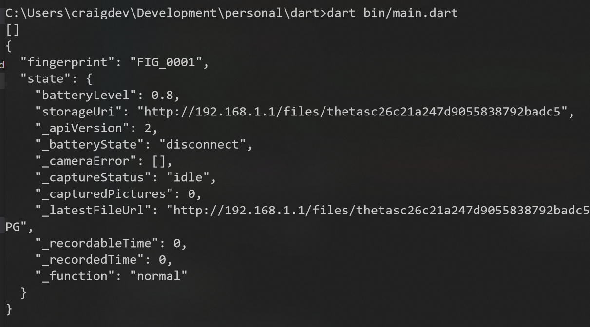
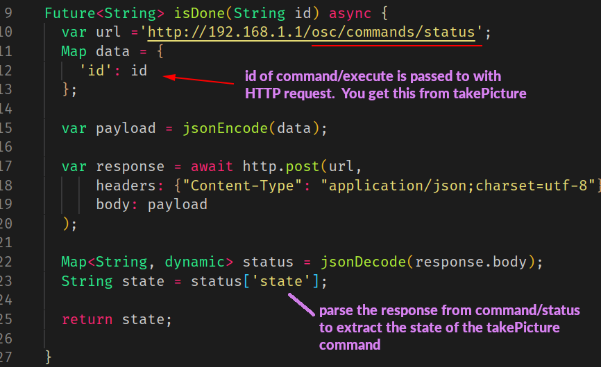

# RICOH THETA SC2 HTTP Request tests


Tested with SC2 firmware version 1.31.
Last updated July 17, 2020. 

The SC2 API has many differences from the API used with the V and Z1.  As of June 17, 2020, the online
[API documentation](https://api.ricoh/docs/theta-web-api-v2.1/) on the RICOH
site is not an accurate
reference to build SC2 applications. 


## Usage

1. connect workstation to THETA with camera in access point (AP) mode
2. run `main.dart` file in `bin` with the appropriate command


### Example with info

```dart
$ dart bin/main.dart info
{
  "manufacturer": "RICOH",
  "model": "RICOH THETA SC2",
  "serialNumber": "20001005",
  "firmwareVersion": "01.31",
  "supportUrl": "https://theta360.com/en/support/",
  "gps": false,
  "gyro": true,
  "endpoints": {
    "httpPort": 80,
    "httpUpdatesPort": 80
  },
  "apiLevel": [
    2
  ],
  "api": [
    "/osc/info",
    "/osc/state",
    "/osc/checkForUpdates",
    "/osc/commands/execute",
    "/osc/commands/status"
  ],
  "uptime": 2709,
  "_wlanMacAddress": "58:38:79:2b:ad:c5",
  "_bluetoothMacAddress": "6c:21:a2:47:d9:05"
}
```


Instead of info, you can also use other commands:

### Example with state

```
$ dart bin/main.dart state
{
  "fingerprint": "FIG_0001",
  "state": {
    "batteryLevel": 0.8,
    "storageUri": "http://192.168.1.1/files/thetasc26c21a247d9055838792badc5",
    "_apiVersion": 2,
    "_batteryState": "charged",
    "_cameraError": [],
    "_captureStatus": "idle",
    "_capturedPictures": 0,
    "_latestFileUrl": "http://192.168.1.1/files/thetasc26c21a247d9055838792badc5/100RICOH/R0010095.JPG",
    "_recordableTime": 0,
    "_recordedTime": 0,
    "_function": "normal"
  }
}
```

Working commands:

* info
* state
* takePicture
* listFiles - list last 10 files taken
* getOptions - specify list of options you want to get
* downloadFile - example of downloading the last file taken
* getMetadata - show all metadata.  Does not fully work on SC with firmware 1.31
* firmware - prints firmware version and camera model
* downloadReady - takes pictures and checks if picture is ready for download
* takeAndDownload - take picture and download using osc/state to get file URL
* setExposureDelayFive - set self-timer to five
* setExposureDelayZero - turn off self-timer
* getTimeShift - check if SC2 is in timeshift mode, takes two pictures, one lens at a time
* setCapturePreset - set SC2-specific preset modes to SC2. "face", "nightView", "lensbylensExposure"
* setHdr - SC2-specific command to set the _filter option that controls HDR mode
* setShutter - set shutter speed
* autoBracket - set SC2 to take bracketed images
* startCapture - start continuous shooting.  The type of shooting is controlled by `_mode`.
* saveHdr - uses `_setMySetting to save` `_filter` as hdr.  If you don't save the setting, it will revert back to _filter off.
* filterOff - turns off SC2 image filter.  This disables hdr, Hh hdr, Noise Reduction, DR Comp.  The _filter value is normally turned off when the camera goes to sleep or the Wi-Fi connection is dropped.
* sleepOff - disable camera auto-sleep
* offOff - disable camera auto power off
* reset - reset camera to default settings (SC2 does not reset all settings)
* getThumb - get thumbnail from SC2 list files.  This is a workaround as the published
API does not work with the SC2.  Saves thumbnail to local storage for testing.
* getThumb2 - alternate method of getting thumbnails using type=thumb
* setlanguage - set human language of device.  supported values: en-US, en-GB, ja, fr, de, zh-TW, zh-CN, it, ko
* status - check camera status with ID
* resetMySetting - resets camera settings stored in MySetting. This could include
HDR, exposure compensation, whiteBalance, iso, shutterSpeed, and _colorTemperature


## Explanation

### POST example

response from THETA SC2




### Take Picture Example

If you send a payload such as `{'name': 'camera.takePicture'}` as part of your 
request, you must encode the body as JSON.  You can use `json.encode(your-payload-object)` 
or the new `jsonEncode()` https://api.dart.dev/stable/2.7.1/dart-convert/jsonEncode.html


Test from THETA SC2.  OK!

Response from SC2 shown below.

```javascript
C:\Users\craigdev\Development\personal\dart>dart bin/main.dart
[]
200
{
  "name": "camera.takePicture",
  "id": "1588",
  "progress": {
    "completion": 0.0
  },
  "state": "inProgress"
}
```

### List Files

https://api.ricoh/docs/theta-web-api-v2.1/commands/camera.list_files/

This shows a more complex nested payload with parameters.

Response

```javascript
$ dart bin/main.dart 
[]
200
{
  "name": "camera.listFiles",
  "results": {
    "entries": [
      {
        "dateTimeZone": "2020:03:18 17:12:32-07:00",
        "fileUrl": "http://192.168.1.1/files/150100525831424d42079d18e0b6c300/100RICOH/R0010024.JPG",
        "height": 2688,
        "isProcessed": true,
        "name": "R0010024.JPG",
        "previewUrl": "",
        "_projectionType": "Equirectangular",
        "size": 4362617,
        "_thumbSize": 2749,
        "width": 5376
      },
```
### Get Options

The camera options you want to get need to be specified individually in an array.
I do not think you can get all the options with a wildcard or "all" specification.

Format of the data request is below.

```javascript
var url ='http://192.168.1.1/osc/commands/execute';

  Map data = {
    'name': 'camera.getOptions',
    'parameters': {
      'optionNames': [
        "iso",
        "isoSupport"
      ]
    }
```

Response from a THETA SC2 running firmware 1.20 is shown below.

```javascript
{
  "name": "camera.getOpions",
  "state": "done",
  "results": {
    "options": {
      "iso": 0,
      "isoSupport": [
        64,
        80,
        100,
        125,
        160,
        200,
        250,
        320,
        400,
        500,
        640,
        800,
        1000,
        1250,
        1600,
        2000,
        2500,
        3200
      ]
    }
  }
}
```

#### Addtional Options

In my tests, there are significant differences between the THETA V options
and the options for SC2.  In your tests, you can try each option individually
to see what is supported.

Note that in the test of the SC2 below, the previewFormat is not returning 
the correct values.

The payload is:

```javascript
Map data = {
    'name': 'camera.getOptions',
    'parameters': {
      'optionNames': [
        "offDelay",
        "sleepDelay",
        "remainingSpace",
        "_colorTemperature",
        "previewFormat"
      ]
    }
  };
```

The response from a THETA SC2 running firmware 1.20 is shown below.  Note
that the `previewFormat` is giving 0 values.  This API is likely
not supported at the moment.

```javascript
{
  "name": "camera.getOpions",
  "state": "done",
  "results": {
    "options": {
      "offDelay": 65535,
      "sleepDelay": 65535,
      "remainingSpace": 2168410112,
      "_colorTemperature": 2500,
      "previewFormat": {
        "width": 0,
        "height": 0
      },
      "framerate": 0
    }
  }
}
```

For comparison, this is the response from a THETA V.  See the difference in the
previewFormat information.


## Checking if Camera Picture is Ready to Download





## Troubleshooting Camera

### Testing Connection with GET info

The simplest command to the camera is GET info.

You can test it in a browser, curl, Postman.  In the test program, you can
look for the URL below.

    String url = 'http://192.168.1.1/osc/info';

If you are having problems getting a camera connection and want to test your
code with a known working API that returns a single JSON object, you can use a public Internet test server to return a single JSON object and print it out.

    // String url = 'https://swapi.co/api/people/1';
    // String url = 'https://jsonplaceholder.typicode.com/users/1';

## Configuration and Installation

1. install [dart](https://dart.dev/)
2. clone this repo
3. run `pub get` to install dependencies

```
$ pub get
Resolving dependencies... (1.2s)
Downloading args 1.5.3...
Downloading http 0.12.0+4...
Downloading pedantic 1.9.0...
Downloading async 2.4.0...
Downloading source_span 1.6.0...
Downloading charcode 1.1.3...
Downloading meta 1.1.8...
Got dependencies!
```

## Image Thumbnails

There are problems with getting the image thumbnail using the 
method explained in the official API documentation.  See the 
document below for workarounds.

* [getting SC2 image thumbnails](doc/thumbnails.md)


## More

Read about [why we're using Dart](doc/dart-growth/dart.md).