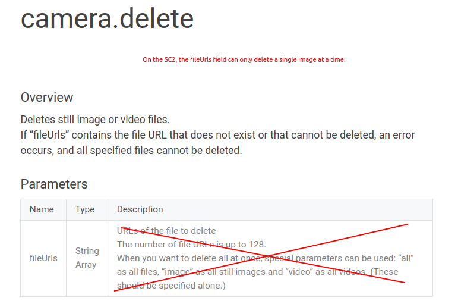

# SC2 API camera.delete problems and workaround

This is a community document based on contributions of
informal test results 
from the [theta360.guide independent community](https://www2.theta360.guide/).  This is
not an official RICOH document.  For official information, please
contact RICOH.  You should confirm these community tips with your
own tests prior to deployment in a business setting.  As these are
unofficial tips, the official RICOH THETA API may change unexpectedly
and these techniques could stop working. 

## Executive Summary

The SC2 API can't delete multiple files.  You must 
delete one file at a time in a loop.

## Problem Use Case

Your staff takes 500 pictures to document a construction site and your
workflow involves deleting the pictures at the end of they day.
You want to enable your staff to delete all the pictures with a single
button press after transfer is verified.

## Problem Description

When using `camera.delete`, the following actions do not work on the SC2.

* multiple fileUrls in the `fileUrls` field
* "all" keyword
* "image" keyword
* "video" keyword



## Problem Verification Test

```bash
$ dart main.dart info
{
  "manufacturer": "RICOH",
  "model": "RICOH THETA SC2",
  "firmwareVersion": "01.31",
  ...
```

### attempt to delete all with SC2

#### Request

```dart
var url = 'http://192.168.1.1/osc/commands/execute';
Map<String, String> headers = {
  "Content-Type": "application/json;charset=utf-8"
};

Future<void> deleteTest() async {
  Map payload = {
    "name": "camera.delete",
    "parameters": {
      "fileUrls": ["all"]
    }
  };
  var body = jsonEncode(payload);
  var response = await http.post(url, headers: headers, body: body);
```

#### response from SC2

```bash
$ dart main.dart deleteTest
HTTP status code: 200
{"name":"camera.delete","state":"done"}
```
However, list files shows 29 entries.  No files were deleted.

### compare to Z1

```json
  "firmwareVersion": "1.50.1",
  "manufacturer": "RICOH",
  "model": "RICOH THETA Z1",
```

Start of test, totalEntries is 85.

```json
      }
    ],
    "totalEntries": 85
  },
  "state": "done"
```

Status code and response of the Z1 are the same as on the SC2.  However,
the files on the Z1 are deleted.

```bash
$ dart main.dart deleteTest
HTTP status code: 200
{"name":"camera.delete","state":"done"}
```

Using listFiles to verify that the files on the Z1 are deleted.

```bash
$ dart main.dart listFiles
200
{
  "name": "camera.listFiles",
  "results": {
    "entries": [],
    "totalEntries": 0
  },
  "state": "done"
}
```

## Workaround for SC2

To delete all the files on the SC2, you can use the following procedure.

1. use listFiles to grab all the files
2. parse out the fileUrl on the camera and add to array
3. open a http connection to the camera
4. iterate through the array of fileUrls and delete each file individually
5. close the http connection to the camera

```dart
/// parameter 'all' does not work with SC2
/// you must delete only one URL at a time.
import 'dart:async';
import 'dart:convert';
import 'package:http/http.dart' as http;
import 'package:apitest/pretty_print.dart';
import 'package:apitest/list_files.dart';

var url = 'http://192.168.1.1/osc/commands/execute';
Map<String, String> headers = {
  "Content-Type": "application/json;charset=utf-8"
};

Future<void> deleteAll() async {
  var client = http.Client();
  http.Response allFilesResponse = await listFiles();
  var fileListing = jsonDecode(allFilesResponse.body)["results"]["entries"];
  print('there are ${fileListing.length} images in the camera');

  var urlList = [];
  var numberOfImages = fileListing.length;

  for (var i = 0; i < numberOfImages; i++) {
    urlList.add(fileListing[i]["fileUrl"]);
  }

// loop through images on camera and delete all images

  try {
    for (var i = 0; i < numberOfImages; i++) {
      print('Attempting to delete file ${i + 1} at ${urlList[i]}');

      var body = jsonEncode({
        'name': 'camera.delete',
        'parameters': {
          'fileUrls': [urlList[i]]
        }
      });
      // use client.post instead of http.post to keep the network connection
      // open to send multiple commands.
      // make sure to close the connection with client.close() at the
      // end of the command sequence
      var testResponse = await client.post(url, headers: headers, body: body);
      if (testResponse.statusCode == 200) {
        print('successfully deleted image ${i + 1}');
        print('------------------------------------\n');
      } else {
        print(
            'Something went wrong.  Check http status code: ${testResponse.statusCode}');
      }
    }
  } catch (e) {
    print(e);
  } finally {
    client.close();
    print('closed client');
  }
}
```

---
This tip and many more SC2 developer articles are available on the 
[SC2 Developers Community Site](https://theta360.guide/special/sc2/).
Markdown to PDF conversion done with [Grip](https://github.com/joeyespo/grip). 

__This is not an official RICOH document. It is produced by
an independent community.  Please contact RICOH for official
information.__ 